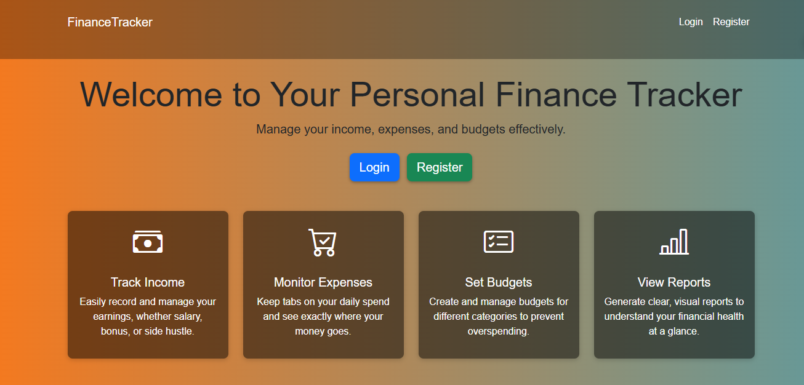
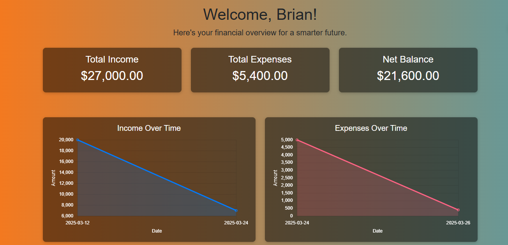
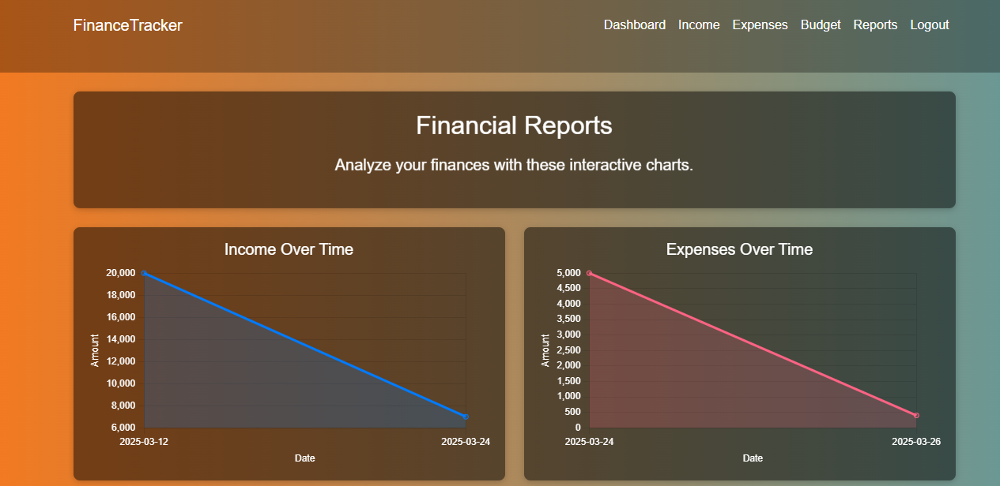

# Personal Finance Tracker

A web-based application built with **PHP**, **MySQL**, **Bootstrap**, and **Chart.js** to help users easily manage their personal finances. This system allows users to:

- **Track Income**  
- **Record Expenses**  
- **Set Budgets**  
- **Generate and Visualize Reports**

## Table of Contents

1. [Features](#features)  
2. [Prerequisites](#prerequisites)  
3. [Installation](#installation)  
4. [Database Setup](#database-setup)  
5. [Configuration](#configuration)  
6. [Usage](#usage)  
7. [Screenshots](#screenshots)  
8. [Folder Structure](#folder-structure)  
9. [Contributing](#contributing)  
10. [License](#license)  

---

## Features

- **User Authentication**: Users can register and log in securely (password hashing, sessions).  
- **Income Management**: Record various income sources (salary, bonuses, freelance, etc.).  
- **Expense Tracking**: Categorize and log all expenses, providing insights on spending patterns.  
- **Budgeting**: Set budgets for different categories (e.g., Groceries, Rent, Utilities) to keep spending under control.  
- **Reporting**: Generate visual charts (line and pie) for income and expenses, giving a clear picture of financial health.  
- **Responsive Design**: Built with [Bootstrap 5](https://getbootstrap.com/), ensuring mobile-friendly layouts.  

---

## Prerequisites

- **PHP** (v7.4+ recommended)  
- **MySQL** (or MariaDB)  
- **Web Server** (e.g., Apache, Nginx, or XAMPP)  
- **Composer** (optional, if you plan to manage dependencies that way)  

---

## Installation

1. **Clone the repository**:
   ```bash
   git clone https://github.com/d-kibet/personal-finance-tracker.git
   cd personal-finance-tracker
   ```

2. **Move the project folder** into your local server’s root directory.  
   - For XAMPP on Windows, that might be `C:\xampp\htdocs\personal-finance-tracker`.  
   - For Linux/Mac, it could be `/var/www/html/personal-finance-tracker`.

3. **(Optional) Install dependencies** using Composer (if you have any PHP libraries in `composer.json`):
   ```bash
   composer install
   ```

---

## Database Setup

1. **Create a new MySQL database**:
   ```sql
   CREATE DATABASE personal_finance_tracker;
   ```
2. **Import the SQL schema** into the database (e.g., via phpMyAdmin or MySQL CLI):
   ```bash
   mysql -u your_db_username -p personal_finance_tracker < database-schema.sql
   ```

---

## Configuration

1. **Open `config.php`** in the project root.  
2. **Update the database credentials**:
   ```php
   $host = 'localhost';
   $db   = 'personal_finance_tracker';
   $user = 'your_db_username';
   $pass = 'your_db_password';
   ```
3. **Adjust other settings** as needed (e.g., charset, PDO options).

---

## Usage

1. **Start your web server** (e.g., XAMPP, WAMP, or Apache/Nginx).  
2. **Navigate to** `http://localhost/personal-finance-tracker` (or your chosen path).  
3. **Register** a new account or **Login** if you already have one.  
4. **Add Income** entries, **Add Expense** entries, and **Set Budgets**.  
5. **View the Dashboard** to see an overview of your finances.  
6. **Generate Reports** on the `reports.php` page for visual insights (line charts, pie charts).  

---

## Screenshots

<details>
<summary>Click to Expand</summary>

**Landing Page (index.php)**  


**Dashboard**  


**Reports**  


</details>

---

## Contributing

1. Fork this repository.  
2. Create a new branch for your feature or bug fix:  
   ```bash
   git checkout -b feature/awesome-improvement
   ```
3. Commit your changes:  
   ```bash
   git commit -m "Add some awesome improvement"
   ```
4. Push to your fork:  
   ```bash
   git push origin feature/awesome-improvement
   ```
5. Create a Pull Request on GitHub, describing your changes.

---

## License

This project is licensed under the [MIT License](LICENSE). Feel free to modify and distribute this software as per the license terms.

---

**Thank you for using the Personal Finance Tracker!** If you have any questions or issues, please open an [issue](https://github.com/d-kibet/personal-finance-tracker/issues) on GitHub. We appreciate your feedback and contributions.
